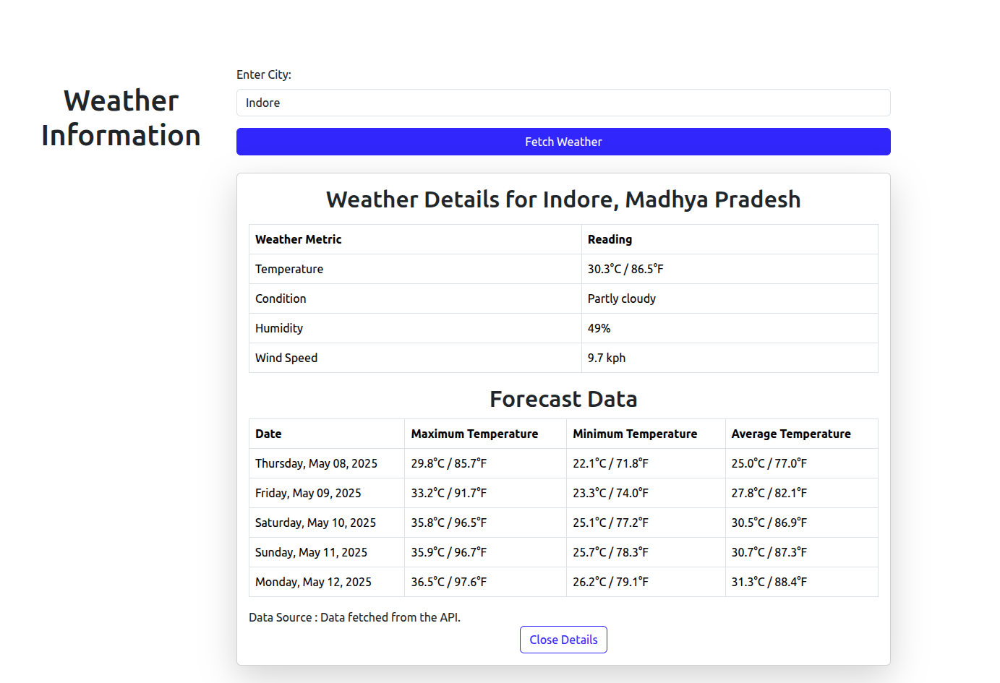

# Weather Application

This is a weather application built with Ruby on Rails that fetches weather data for a given city using the [WeatherAPI](https://www.weatherapi.com/). The app supports caching to improve performance by storing previously fetched data and reusing it for subsequent requests.

## Features

- Fetches real-time weather data and forecast for a given city.
- Uses the [WeatherAPI](https://www.weatherapi.com/) for retrieving weather data.
- Caches weather data to minimize API calls.
- Displays current weather conditions, including temperature, humidity, wind speed, and more.
- Displays a 5-day weather forecast with maximum, minimum, and average temperatures.

## Prerequisites

Make sure you have the following installed on your system:

- Ruby (version 3.2.2)
- Rails (version 7.1.5)
- Bundler (`gem install bundler`)
- PostgreSQL 

## Setup

### 1. Clone the Repository

Clone the repository to your local machine:

```bash
git clone https://github.com/bhaveshrordev/weather-app.git
cd weather-app
```

### 2. Install Dependencies

Install the required gems:

```bash
bundle install
```

### 3. Create and Configure the `.env` File

This application uses the `dotenv` gem to load environment variables from a `.env` file. This file should **not** be committed to version control. To create it, copy the `.env.example` file:

```bash
cp .env.example .env
```

Open the `.env` file and set the required environment variables, such as your Weather API key.

Example `.env` file:

```env
# Weather API Key
WEATHER_API_KEY=your_weather_api_key_here
```

You can obtain your Weather API key by signing up at [WeatherAPI](https://www.weatherapi.com/).

### 4. Setup the Database (if applicable)

If your app uses a database (e.g., PostgreSQL), run the following commands to create and migrate the database:

```bash
rails db:create
rails db:migrate
```

### 5. Start the Application

Once you've configured the environment and database, you can start the Rails server:

```bash
rails server
```

Now, open `http://localhost:3000` in your browser to access the application.

## Usage

1. Visit the home page of the application.
2. Enter a city name in the input field and click the "Fetch Weather" button.
3. The app will display the current weather conditions and a 5-day forecast for the specified city.
4. It will indicate if the data was fetched from the cache or the API.

### Error Handling

If no data is found for a city or an error occurs while fetching data, an alert will be displayed with a message like: "No data found for 'City Name'. Please try again."

## Caching

- Weather data is cached for **30 minutes** using Rails' memory cache. If the same city is queried again within this time, the app will return the cached data, improving performance.
- The app will indicate whether the data was fetched from the cache or from the API.

## Testing

This application uses RSpec for testing. To run the test suite, use the following command:

```bash
rails spec
```

### 1. Install RSpec (if not already installed)

Add RSpec to your Gemfile:

```ruby
group :test do
  gem 'rspec-rails'
end
```

Then run:

```bash
bundle install
rails generate rspec:install
```

### 2. Run the Tests

You can now run the tests using:

```bash
rails spec
```

## Screenshots

### 1. Fetch Weather Data



## Contributing

1. Fork the repository.
2. Create a new branch (`git checkout -b feature-branch`).
3. Commit your changes (`git commit -am 'Add feature'`).
4. Push to the branch (`git push origin feature-branch`).
5. Create a new Pull Request.

## License

This project is licensed under the MIT License - see the [LICENSE.md](LICENSE.md) file for details.

---

## Notes

- **Security**: Always keep your `.env` file private and never commit it to version control. You can use a `.env.example` file to provide a template for others to create their own `.env` file.
- **Environment Variables**: You can add additional environment variables to the `.env` file as needed, such as database credentials, API keys for third-party services, etc.
- **Rate Limiting**: Be mindful of API rate limits when using WeatherAPI. Make sure to check the WeatherAPI documentation for any limitations.

---
